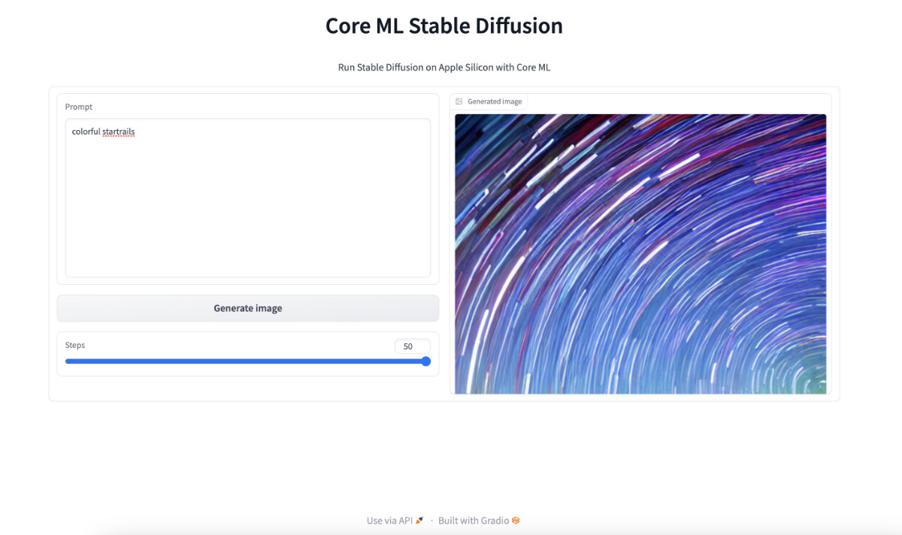

# Core ML Stable Diffusion

Run Stable Diffusion on Apple Silicon with Core ML

[\[Blog Post\]](https://machinelearning.apple.com/research/stable-diffusion-coreml-apple-silicon) [\[BibTeX\]](#bibtex)

This repository comprises:

- `python_coreml_stable_diffusion`, a Python package for converting PyTorch models to Core ML format and performing image generation with Hugging Face [diffusers](https://github.com/huggingface/diffusers) in Python
- `StableDiffusion`, a Swift package that developers can add to their Xcode projects as a dependency to deploy image generation capabilities in their apps. The Swift package relies on the Core ML model files generated by `python_coreml_stable_diffusion`

If you run into issues during installation or runtime, please refer to the [FAQ](#faq) section. Please refer to the [System Requirements](#system-requirements) section before getting started.


## <a name="system-requirements"></a> System Requirements

Model Conversion:

| macOS | Python | coremltools |
| :---: | :----: | :---------: |
| 13.1  |  3.8   |     7.0     |

Project Build:

| macOS | Xcode | Swift |
| :---: | :---: | :---: |
| 14.0  | 15.0  |  5.8  |

Target Device Runtime:

| macOS | iPadOS, iOS |
| :---: | :---------: |
| 13.1  |    16.2     |

Target Device Runtime ([With Memory Improvements](#compression)):

| macOS | iPadOS, iOS |
| :---: | :---------: |
| 14.0  |    17.0     |

Target Device Hardware Generation:

| Mac | iPad | iPhone |
| :-: | :--: | :----: |
| M1  |  M1  |  A14   |

## <a name="performance-benchmark"></a> Performance Benchmarks

[`stabilityai/stable-diffusion-2-1-base`](https://huggingface.co/apple/coreml-stable-diffusion-2-1-base) Benchmark:

| Device                | `--compute-unit` | `--attention-implementation` | End-to-End Latency (s) | Diffusion Speed (iter/s) |
| --------------------- | ---------------- | ---------------------------- | ---------------------- | ------------------------ |
| iPhone 12 Mini        | `CPU_AND_NE`     | `SPLIT_EINSUM_V2`            | 20                     | 1.3                      |
| iPhone 12 Pro Max     | `CPU_AND_NE`     | `SPLIT_EINSUM_V2`            | 17                     | 1.4                      |
| iPhone 13             | `CPU_AND_NE`     | `SPLIT_EINSUM_V2`            | 15                     | 1.7                      |
| iPhone 13 Pro Max     | `CPU_AND_NE`     | `SPLIT_EINSUM_V2`            | 12                     | 1.8                      |
| iPhone 14             | `CPU_AND_NE`     | `SPLIT_EINSUM_V2`            | 13                     | 1.8                      |
| iPhone 14 Pro Max     | `CPU_AND_NE`     | `SPLIT_EINSUM_V2`            | 9                      | 2.3                      |
| iPad Pro (M1)         | `CPU_AND_NE`     | `SPLIT_EINSUM_V2`            | 11                     | 2.1                      |
| iPad Pro (M2)         | `CPU_AND_NE`     | `SPLIT_EINSUM_V2`            | 8                      | 2.9                      |
| Mac Studio (M1 Ultra) | `CPU_AND_GPU`    | `ORIGINAL`                   | 4                      | 6.3                      |
| Mac Studio (M2 Ultra) | `CPU_AND_GPU`    | `ORIGINAL`                   | 3                      | 7.6                      |

<details>
  <summary> Details (Click to expand) </summary>

- This benchmark was conducted by Apple using public beta versions of iOS 17.0, iPadOS 17.0 and macOS 14.0 in June 2023.
- The performance data was collected by running the `StableDiffusion` Swift pipeline.
- Swift code is not fully optimized, introducing up to ~10% overhead unrelated to Core ML model execution.
- The median latency value across 3 back-to-back end-to-end executions are reported
- The image generation procedure follows the standard configuration: 20 inference steps, 512x512 output image resolution, 77 text token sequence length, classifier-free guidance (batch size of 2 for unet).
- The actual prompt length does not impact performance because the Core ML model is converted with a static shape that computes the forward pass for all of the 77 elements (`tokenizer.model_max_length`) in the text token sequence regardless of the actual length of the input text.
- Weights are compressed to 6 bit precision. Please refer to [this section](#compression) for details.
- Activations are in float16 precision for both the GPU and the Neural Engine.
- For iPhone 12 mini and iPhone 13, we enable the [reduceMemory](https://github.com/apple/ml-stable-diffusion/blob/main/swift/StableDiffusion/pipeline/StableDiffusionPipeline.swift#L65) option to load and unload models just-in-time to avoid memory issues. This added up to 2 seconds to the end-to-end latency.
- In the benchmark table, we report the best performing `--compute-unit` and `--attention-implementation` values per device. The former does not modify the Core ML model and can be applied during runtime. The latter modifies the Core ML model. Note that the best performing compute unit is model version and hardware-specific.
- Note that the performance optimizations in this repository (e.g. `--attention-implementation`) are generally applicable to Transformers and not customized to Stable Diffusion. Better performance may be observed upon custom kernel tuning. Therefore, these numbers do not represent **peak** HW capability.
- Performance may vary across different versions of Stable Diffusion due to architecture changes in the model itself. Each reported number is specific to the model version mentioned in that context.
- Performance may vary due to factors like increased system load from other applications or suboptimal device thermal state. Given these factors, we do not report sub-second variance in latency.

</details>

## <a name="compression"></a> Weight Compression

coremltools-7.0 supports advanced weight compression techniques for [pruning](https://coremltools.readme.io/v7.0/docs/pruning), [palettization](https://coremltools.readme.io/v7.0/docs/palettization-overview) and [linear 8-bit quantization](https://coremltools.readme.io/v7.0/docs/quantization-aware-training). For these techniques, `coremltools.optimize.torch.*` includes APIs that require fine-tuning to maintain accuracy at higher compression rates whereas `coremltools.optimize.coreml.*` includes APIs that are applied post-training and are data-free.

We demonstrate how data-free [post-training palettization](https://coremltools.readme.io/v7.0/docs/post-training-palettization) implemented in `coremltools.optimize.coreml.palettize_weights` enables us to achieve greatly improved performance for Stable Diffusion on mobile devices. This API implements the [Fast Exact k-Means](https://arxiv.org/abs/1701.07204) algorithm for optimal weight clustering which yields more accurate palettes. Using `--quantize-nbits {2,4,6,8}` during [conversion](#converting-models-to-coreml) is going to apply this compression to the unet and text_encoder models.

For best results, we recommend [training-time palettization](https://coremltools.readme.io/v7.0/docs/training-time-palettization): `coremltools.optimize.torch.palettization.DKMPalettizer` if fine-tuning your model is feasible. This API implements the [Differentiable k-Means (DKM)](https://machinelearning.apple.com/research/differentiable-k-means) learned palettization algorithm. In this exercise, we stick to post-training palettization for the sake of simplicity and ease of reproducibility.

The Neural Engine is capable of accelerating models with low-bit palettization: 2, 4, 6 or 8 bits. With iOS 17 and macOS 14, compressed weights for Core ML models can be just-in-time decompressed during runtime (as opposed to ahead-of-time decompression upon load) to match the precision of activation tensors. This yields significant memory savings and enables models to run on devices with smaller RAM (e.g. iPhone 12 Mini). In addition, compressed weights are faster to fetch from memory which reduces the latency of memory bandwidth-bound layers. The just-in-time decompression behavior depends on the compute unit, layer type and hardware generation.

| Weight Precision |  `--compute-unit`  | [`stabilityai/stable-diffusion-2-1-base`](https://huggingface.co/apple/coreml-stable-diffusion-2-1-base) generating _"a high quality photo of a surfing dog"_ |
| :--------------: | :----------------: | ------------------------------------------------------------------------------------------------------------------------------------------------------------- |
|      6-bit       | cpuAndNeuralEngine |                                                                                                            |
|      16-bit      | cpuAndNeuralEngine |                                                                                                             |
|      16-bit      |     cpuAndGPU      |                                                                                                                  |

Note that there are minor differences across 16-bit (float16) and 6-bit results. These differences are comparable to the differences across float16 and float32 or differences across compute units as exemplified above. We recommend a minimum of 6 bits for palettizing Stable Diffusion. Smaller number of bits (2 and 4) will require fine-tuning to recover image generation quality as previously mentioned.

Resources:

- [Core ML Tools Docs: Optimizing Models](https://coremltools.readme.io/v7.0/docs/optimizing-models)
- [WWDC23 Session Video: Use Core ML Tools for machine learning model compression](https://developer.apple.com/videos/play/wwdc2023/10047)

## <a name="using-controlnet"></a> Using ControlNet

Example results using the prompt _"a high quality photo of a surfing dog"_ conditioned on the scribble (leftmost):


[ControlNet](https://huggingface.co/lllyasviel/ControlNet) allows users to condition image generation with Stable Diffusion on signals such as edge maps, depth maps, segmentation maps, scribbles and pose. Thanks to [@ryu38's contribution](https://github.com/apple/ml-stable-diffusion/pull/153), both the Python CLI and the Swift package support ControlNet models. Please refer to [this section](#converting-models-to-coreml) for details on setting up Stable Diffusion with ControlNet.

## <a name="system-multilingual-text-encoder"></a> Using the System Multilingual Text Encoder

<details>
  <summary> Details (Click to expand) </summary>

With iOS 17 and macOS 14, `NaturalLanguage` framework introduced the [NLContextualEmbedding](https://developer.apple.com/documentation/naturallanguage/nlcontextualembedding) which provides Transformer-based textual embeddings for Latin (20 languages), Cyrillic (4 langauges) and CJK (3 languages) scripts. The WWDC23 session titled [Explore Natural Language multilingual models](https://developer.apple.com/videos/play/wwdc2023/10042) demonstrated how this powerful new model can be used by developers to train downstream tasks such as multilingual image generation with Stable Diffusion.

The code to reproduce this demo workflow is made available in this repository. There are several ways in which this workflow can be implemented. Here is an example:

**Step 1:** Curate an image-text dataset with the desired languages.

**Step 2:** Pre-compute the NLContextualEmbedding values and replace the text strings with these embedding vectors in your dataset.

**Step 3:** Fine-tune a base model from Hugging Face Hub that is compatible with the [StableDiffusionPipeline](https://huggingface.co/docs/diffusers/api/pipelines/stable_diffusion/overview) by using your new dataset and replacing the default text_encoder with your pre-computed NLContextualEmbedding values.

**Step 4:** In order to be able to swap the text_encoder of a base model without training new layers, the base model's `text_encoder.hidden_size` must match that of NLContextualEmbedding. If it doesn't, you will need to train a linear projection layer to map between the two dimensionalities. After fine-tuning, this linear layer should be converted to CoreML as follows:

```shell
python -m python_coreml_stable_diffusion.multilingual_projection --input-path <path-to-projection-torchscript> --output-dir <output-dir>
```

The command above will yield a `MultilingualTextEncoderProjection.mlmodelc` file under `--output-dir` and this should be colocated with the rest of the Core ML model assets that were generated through `--bundle-resources-for-swift-cli`.

**Step 5:** The multilingual system text encoder can now be invoked by setting `useMultilingualTextEncoder` to true when initializing a pipeline or setting `--use-multilingual-text-encoder` in the CLI. Note that the model assets are distributed over-the-air so the first invocation will trigger asset downloads which is less than 100MB.

Resources:

- [WWDC23 Session Video: Explore Natural Language multilingual models](https://developer.apple.com/videos/play/wwdc2023/10042)
- [NLContextualEmbedding API Documentation](https://developer.apple.com/documentation/naturallanguage/nlcontextualembedding)

</details>

## <a name="using-converted-weights"></a> Using Ready-made Core ML Models from Hugging Face Hub

<details>
  <summary> Click to expand </summary>

🤗 Hugging Face ran the [conversion procedure](#converting-models-to-coreml) on the following models and made the Core ML weights publicly available on the Hub. If you would like to convert a version of Stable Diffusion that is not already available on the Hub, please refer to the [Converting Models to Core ML](#converting-models-to-core-ml).

- 6-bit quantized models (suitable for iOS 17 and macOS 14):

  - [`CompVis/stable-diffusion-v1-4`](https://huggingface.co/apple/coreml-stable-diffusion-1-4-palettized)
  - [`runwayml/stable-diffusion-v1-5`](https://huggingface.co/apple/coreml-stable-diffusion-v1-5-palettized)
  - [`stabilityai/stable-diffusion-2-base`](https://huggingface.co/apple/coreml-stable-diffusion-2-base-palettized)
  - [`stabilityai/stable-diffusion-2-1-base`](https://huggingface.co/apple/coreml-stable-diffusion-2-1-base-palettized)

- Uncompressed models:
  - [`CompVis/stable-diffusion-v1-4`](https://huggingface.co/apple/coreml-stable-diffusion-v1-4)
  - [`runwayml/stable-diffusion-v1-5`](https://huggingface.co/apple/coreml-stable-diffusion-v1-5)
  - [`stabilityai/stable-diffusion-2-base`](https://huggingface.co/apple/coreml-stable-diffusion-2-base)
  - [`stabilityai/stable-diffusion-2-1-base`](https://huggingface.co/apple/coreml-stable-diffusion-2-1-base)

If you want to use any of those models you may download the weights and proceed to [generate images with Python](#image-generation-with-python) or [Swift](#image-generation-with-swift).

There are several variants in each model repository. You may clone the whole repos using `git` and `git lfs` to download all variants, or selectively download the ones you need.

To clone the repos using `git`, please follow this process:

**Step 1:** Install the `git lfs` extension for your system.

`git lfs` stores large files outside the main git repo, and it downloads them from the appropriate server after you clone or checkout. It is available in most package managers, check [the installation page](https://git-lfs.com) for details.

**Step 2:** Enable `git lfs` by running this command once:

```bash
git lfs install
```

**Step 3:** Use `git clone` to download a copy of the repo that includes all model variants. For Stable Diffusion version 1.4, you'd issue the following command in your terminal:

```bash
git clone https://huggingface.co/apple/coreml-stable-diffusion-v1-4
```

If you prefer to download specific variants instead of cloning the repos, you can use the `huggingface_hub` Python library. For example, to do generation in Python using the `ORIGINAL` attention implementation (read [this section](#converting-models-to-core-ml) for details), you could use the following helper code:

```Python
from huggingface_hub import snapshot_download
from pathlib import Path

repo_id = "apple/coreml-stable-diffusion-v1-4"
variant = "original/packages"

model_path = Path("./models") / (repo_id.split("/")[-1] + "_" + variant.replace("/", "_"))
snapshot_download(repo_id, allow_patterns=f"{variant}/*", local_dir=model_path, local_dir_use_symlinks=False)
print(f"Model downloaded at {model_path}")
```

`model_path` would be the path in your local filesystem where the checkpoint was saved. Please, refer to [this post](https://huggingface.co/blog/diffusers-coreml) for additional details.

</details>

## <a name="converting-models-to-coreml"></a> Converting Models to Core ML

<details>
  <summary> Click to expand </summary>

**Step 1:** Create a Python environment and install dependencies:

```bash
conda create -n coreml_stable_diffusion python=3.8 -y
conda activate coreml_stable_diffusion
cd /path/to/cloned/ml-stable-diffusion/repository
pip install -e .
```

**Step 2:** Log in to or register for your [Hugging Face account](https://huggingface.co), generate a [User Access Token](https://huggingface.co/settings/tokens) and use this token to set up Hugging Face API access by running `huggingface-cli login` in a Terminal window.

**Step 3:** Navigate to the version of Stable Diffusion that you would like to use on [Hugging Face Hub](https://huggingface.co/models?search=stable-diffusion) and accept its Terms of Use. The default model version is [CompVis/stable-diffusion-v1-4](https://huggingface.co/CompVis/stable-diffusion-v1-4). The model version may be changed by the user as described in the next step.

**Step 4:** Execute the following command from the Terminal to generate Core ML model files (`.mlpackage`)

```shell
python -m python_coreml_stable_diffusion.torch2coreml --convert-unet --convert-text-encoder --convert-vae-decoder --convert-safety-checker -o <output-mlpackages-directory>
```

**WARNING:** This command will download several GB worth of PyTorch checkpoints from Hugging Face. Please ensure that you are on Wi-Fi and have enough disk space.

This generally takes 15-20 minutes on an M1 MacBook Pro. Upon successful execution, the 4 neural network models that comprise Stable Diffusion will have been converted from PyTorch to Core ML (`.mlpackage`) and saved into the specified `<output-mlpackages-directory>`. Some additional notable arguments:

- `--model-version`: The model version defaults to [CompVis/stable-diffusion-v1-4](https://huggingface.co/CompVis/stable-diffusion-v1-4). Developers may specify other versions that are available on [Hugging Face Hub](https://huggingface.co/models?search=stable-diffusion), e.g. [stabilityai/stable-diffusion-2-base](https://huggingface.co/stabilityai/stable-diffusion-2-base) & [runwayml/stable-diffusion-v1-5](https://huggingface.co/runwayml/stable-diffusion-v1-5).

- `--bundle-resources-for-swift-cli`: Compiles all 4 models and bundles them along with necessary resources for text tokenization into `<output-mlpackages-directory>/Resources` which should provided as input to the Swift package. This flag is not necessary for the diffusers-based Python pipeline.

- `--quantize-nbits`: Quantizes the weights of unet and text_encoder models down to 2, 4, 6 or 8 bits using a globally optimal k-means clustering algorithm. By default all models are weight-quantized to 16 bits even if this argument is not specified. Please refer to [this section](#compression for details and further guidance on weight compression.

- `--chunk-unet`: Splits the Unet model in two approximately equal chunks (each with less than 1GB of weights) for mobile-friendly deployment. This is **required** for Neural Engine deployment on iOS and iPadOS if weights are not quantized to 6-bits or less (`--quantize-nbits {2,4,6}`). This is not required for macOS. Swift CLI is able to consume both the chunked and regular versions of the Unet model but prioritizes the former. Note that chunked unet is not compatible with the Python pipeline because Python pipeline is intended for macOS only.

- `--attention-implementation`: Defaults to `SPLIT_EINSUM` which is the implementation described in [Deploying Transformers on the Apple Neural Engine](https://machinelearning.apple.com/research/neural-engine-transformers). `--attention-implementation SPLIT_EINSUM_V2` yields 10-30% improvement for mobile devices, still targeting the Neural Engine. `--attention-implementation ORIGINAL` will switch to an alternative implementation that should be used for CPU or GPU deployment on some Mac devices. Please refer to the [Performance Benchmark](#performance-benchmark) section for further guidance.

- `--check-output-correctness`: Compares original PyTorch model's outputs to final Core ML model's outputs. This flag increases RAM consumption significantly so it is recommended only for debugging purposes.

- `--convert-controlnet`: Converts ControlNet models specified after this option. This can also convert multiple models if you specify like `--convert-controlnet lllyasviel/sd-controlnet-mlsd lllyasviel/sd-controlnet-depth`.

- `--unet-support-controlnet`: enables a converted UNet model to receive additional inputs from ControlNet. This is required for generating image with using ControlNet and saved with a different name, `*_control-unet.mlpackage`, distinct from normal UNet. On the other hand, this UNet model can not work without ControlNet. Please use normal UNet for just txt2img.

</details>

## <a name="image-generation-with-python"></a> Image Generation with Python

<details>
  <summary> Click to expand </summary>

Run text-to-image generation using the example Python pipeline based on [diffusers](https://github.com/huggingface/diffusers):

```shell
python -m python_coreml_stable_diffusion.pipeline --prompt "a photo of an astronaut riding a horse on mars" -i <output-mlpackages-directory> -o </path/to/output/image> --compute-unit ALL --seed 93
```

Please refer to the help menu for all available arguments: `python -m python_coreml_stable_diffusion.pipeline -h`. Some notable arguments:

- `-i`: Should point to the `-o` directory from Step 4 of [Converting Models to Core ML](#converting-models-to-coreml) section from above.
- `--model-version`: If you overrode the default model version while converting models to Core ML, you will need to specify the same model version here.
- `--compute-unit`: Note that the most performant compute unit for this particular implementation may differ across different hardware. `CPU_AND_GPU` or `CPU_AND_NE` may be faster than `ALL`. Please refer to the [Performance Benchmark](#performance-benchmark) section for further guidance.
- `--scheduler`: If you would like to experiment with different schedulers, you may specify it here. For available options, please see the help menu. You may also specify a custom number of inference steps by `--num-inference-steps` which defaults to 50.
- `--controlnet`: ControlNet models specified with this option are used in image generation. Use this option in the format `--controlnet lllyasviel/sd-controlnet-mlsd lllyasviel/sd-controlnet-depth` and make sure to use `--controlnet-inputs` in conjunction.
- `--controlnet-inputs`: Image inputs corresponding to each ControlNet model. Please provide image paths in same order as models in `--controlnet`, for example: `--controlnet-inputs image_mlsd image_depth`.

</details>

## <a name="image-gen-swift"></a> Image Generation with Swift

<details>
  <summary> Click to expand </summary>

### Example CLI Usage

```shell
swift run StableDiffusionSample "a photo of an astronaut riding a horse on mars" --resource-path <output-mlpackages-directory>/Resources/ --seed 93 --output-path </path/to/output/image>
```

The output will be named based on the prompt and random seed:
e.g. `</path/to/output/image>/a_photo_of_an_astronaut_riding_a_horse_on_mars.93.final.png`

Please use the `--help` flag to learn about batched generation and more.

### Example Library Usage

```swift
import StableDiffusion
...
let pipeline = try StableDiffusionPipeline(resourcesAt: resourceURL)
pipeline.loadResources()
let image = try pipeline.generateImages(prompt: prompt, seed: seed).first
```

On iOS, the `reduceMemory` option should be set to `true` when constructing `StableDiffusionPipeline`

### Swift Package Details

This Swift package contains two products:

- `StableDiffusion` library
- `StableDiffusionSample` command-line tool

Both of these products require the Core ML models and tokenization resources to be supplied. When specifying resources via a directory path that directory must contain the following:

- `TextEncoder.mlmodelc` (text embedding model)
- `Unet.mlmodelc` or `UnetChunk1.mlmodelc` & `UnetChunk2.mlmodelc` (denoising autoencoder model)
- `VAEDecoder.mlmodelc` (image decoder model)
- `vocab.json` (tokenizer vocabulary file)
- `merges.text` (merges for byte pair encoding file)

Optionally, for image2image, in-painting, or similar:

- `VAEEncoder.mlmodelc` (image encoder model)

Optionally, it may also include the safety checker model that some versions of Stable Diffusion include:

- `SafetyChecker.mlmodelc`

Optionally, for ControlNet:

- `ControlledUNet.mlmodelc` or `ControlledUnetChunk1.mlmodelc` & `ControlledUnetChunk2.mlmodelc` (enabled to receive ControlNet values)
- `controlnet/` (directory containing ControlNet models)
  - `LllyasvielSdControlnetMlsd.mlmodelc` (for example, from lllyasviel/sd-controlnet-mlsd)
  - `LllyasvielSdControlnetDepth.mlmodelc` (for example, from lllyasviel/sd-controlnet-depth)
  - Other models you converted

Note that the chunked version of Unet is checked for first. Only if it is not present will the full `Unet.mlmodelc` be loaded. Chunking is required for iOS and iPadOS and not necessary for macOS.

</details>

## <a name="swift-app"></a> Example Swift App

<details>
  <summary> Click to expand </summary>

🤗 Hugging Face created an [open-source demo app](https://github.com/huggingface/swift-coreml-diffusers) on top of this library. It's written in native Swift and Swift UI, and runs on macOS, iOS and iPadOS. You can use the code as a starting point for your app, or to see how to integrate this library in your own projects.

Hugging Face has made the app [available in the Mac App Store](https://apps.apple.com/app/diffusers/id1666309574?mt=12).

</details>

## <a name="play-with-simple-web-ui"></a> Play with simple Web UI

 <details>
   <summary> Click to expand </summary>

 

After you have completed the model conversion according to the above process, you can use the following command to start a simple Web UI:

```bash
python -m python_coreml_stable_diffusion.web -i <output-mlpackages-directory> --compute-unit ALL
```

After the command is executed, we will get a log similar to the following:

```bash
WARNING:coremltools:Torch version 1.13.0 has not been tested with coremltools. You may run into unexpected errors. Torch 1.12.1 is the most recent version that has been tested.
INFO:python_coreml_stable_diffusion.pipeline:Initializing PyTorch pipe for reference configuration
...
...
INFO:python_coreml_stable_diffusion.pipeline:Done.
INFO:python_coreml_stable_diffusion.pipeline:Initializing Core ML pipe for image generation
INFO:python_coreml_stable_diffusion.pipeline:Stable Diffusion configured to generate 512x512 images
INFO:python_coreml_stable_diffusion.pipeline:Done.
Running on local URL:  http://0.0.0.0:7860
To create a public link, set `share=True` in `launch()`.
```

Open `http://0.0.0.0:7860` in your browser to start your Core ML Stable Diffusion adventure.
Web UI relies on gradio, a great interface framework. If you have not installed it, then execute the above command, the program will try to install it automatically.
If the installation fails, you can try to manually execute the following command to complete the dependency installation.

```bash
pip install gradio
```

When the installation is complete, re-execute the above command to start the Web UI.

 </details>

## <a name="faq"></a> FAQ

<details>
  <summary> Click to expand </summary>
<details>

<summary> <b> Q1: </b> <code> ERROR: Failed building wheel for tokenizers or error: can't find Rust compiler </code> </summary>

<b> A1: </b> Please review this [potential solution](https://github.com/huggingface/transformers/issues/2831#issuecomment-592724471).

</details>

<details>
<summary> <b> Q2: </b> <code> RuntimeError: {NSLocalizedDescription = "Error computing NN outputs." </code> </summary>

<b> A2: </b> There are many potential causes for this error. In this context, it is highly likely to be encountered when your system is under increased memory pressure from other applications. Reducing memory utilization of other applications is likely to help alleviate the issue.

</details>

<details>
<summary> <b> <a name="low-mem-conversion"></a> Q3: </b> My Mac has 8GB RAM and I am converting models to Core ML using the example command. The process is getting killed because of memory issues. How do I fix this issue? </summary>

<b> A3: </b> In order to minimize the memory impact of the model conversion process, please execute the following command instead:

```bash
python -m python_coreml_stable_diffusion.torch2coreml --convert-vae-encoder -o <output-mlpackages-directory> && \
python -m python_coreml_stable_diffusion.torch2coreml --convert-vae-decoder -o <output-mlpackages-directory> && \
python -m python_coreml_stable_diffusion.torch2coreml --convert-unet -o <output-mlpackages-directory> && \
python -m python_coreml_stable_diffusion.torch2coreml --convert-text-encoder -o <output-mlpackages-directory> && \
python -m python_coreml_stable_diffusion.torch2coreml --convert-safety-checker -o <output-mlpackages-directory> &&
```

If you need `--chunk-unet`, you may do so in yet another independent command which will reuse the previously exported Unet model and simply chunk it in place:

```bash
python -m python_coreml_stable_diffusion.torch2coreml --convert-unet --chunk-unet -o <output-mlpackages-directory>
```

</details>

<details>
<summary> <b> Q4: </b> My Mac has 8GB RAM, should image generation work on my machine? </summary>

<b> A4: </b> Yes! Especially the `--compute-unit CPU_AND_NE` option should work under reasonable system load from other applications. Note that part of the [Example Results](#example-results) were generated using an M2 MacBook Air with 8GB RAM.

</details>

<details>
<summary> <b> Q5: </b> Every time I generate an image using the Python pipeline, loading all the Core ML models takes 2-3 minutes. Is this expected? </summary>

<b> A5: </b> Yes and using the Swift library reduces this to just a few seconds. The reason is that `coremltools` loads Core ML models (`.mlpackage`) and each model is compiled to be run on the requested compute unit during load time. Because of the size and number of operations of the unet model, it takes around 2-3 minutes to compile it for Neural Engine execution. Other models should take at most a few seconds. Note that `coremltools` does not cache the compiled model for later loads so each load takes equally long. In order to benefit from compilation caching, `StableDiffusion` Swift package by default relies on compiled Core ML models (`.mlmodelc`) which will be compiled down for the requested compute unit upon first load but then the cache will be reused on subsequent loads until it is purged due to lack of use.

If you intend to use the Python pipeline in an application, we recommend initializing the pipeline once so that the load time is only incurred once. Afterwards, generating images using different prompts and random seeds will not incur the load time for the current session of your application.

</details>

<details>
<summary> <b> <a name="q-mobile-app"></a> Q6: </b> I want to deploy <code>StableDiffusion</code>, the Swift package, in my mobile app. What should I be aware of? </summary>

<b> A6: </b>The [Image Generation with Swift](#image-gen-swift) section describes the minimum SDK and OS versions as well as the device models supported by this package. We recommend carefully testing the package on the device with the least amount of RAM available among your deployment targets.

The image generation process in `StableDiffusion` can yield over 2 GB of peak memory during runtime depending on the compute units selected. On iPadOS, we recommend using `.cpuAndNeuralEngine` in your configuration and the `reduceMemory` option when constructing a `StableDiffusionPipeline` to minimize memory pressure.

If your app crashes during image generation, consider adding the [Increased Memory Limit](https://developer.apple.com/documentation/bundleresources/entitlements/com_apple_developer_kernel_increased-memory-limit) capability to inform the system that some of your app’s core features may perform better by exceeding the default app memory limit on supported devices.

On iOS, depending on the iPhone model, Stable Diffusion model versions, selected compute units, system load and design of your app, this may still not be sufficient to keep your apps peak memory under the limit. Please remember, because the device shares memory between apps and iOS processes, one app using too much memory can compromise the user experience across the whole device.

We **strongly recommend** quantizing your models with `--quantize-nbits 6` for iOS deployment. This reduces the peak RAM usage by 1GB or more depending on the model version and robustly enables inference even on iPhone 12 Mini.

</details>

<details>
<summary> <b> Q7: </b> How do I generate images with different resolutions using the same Core ML models? </summary>

<b> A7: </b> The current version of `python_coreml_stable_diffusion` does not support single-model multi-resolution out of the box. However, developers may fork this project and leverage the [flexible shapes](https://coremltools.readme.io/docs/flexible-inputs) support from coremltools to extend the `torch2coreml` script by using `coremltools.EnumeratedShapes`. Note that, while the `text_encoder` is agnostic to the image resolution, the inputs and outputs of `vae_decoder` and `unet` models are dependent on the desired image resolution.

</details>

<details>
<summary> <b> Q8: </b> Are the Core ML and PyTorch generated images going to be identical? </summary>

<b> A8: </b> If desired, the generated images across PyTorch and Core ML can be made approximately identical. However, it is not guaranteed by default. There are several factors that might lead to different images across PyTorch and Core ML:

<b> 1. Random Number Generator Behavior </b>

The main source of potentially different results across PyTorch and Core ML is the Random Number Generator ([RNG](https://en.wikipedia.org/wiki/Random_number_generation)) behavior. PyTorch and Numpy have different sources of randomness. `python_coreml_stable_diffusion` generally relies on Numpy for RNG (e.g. latents initialization) and `StableDiffusion` Swift Library reproduces this RNG behavior by default. However, PyTorch-based pipelines such as Hugging Face `diffusers` relies on PyTorch's RNG behavior. Thanks to @liuliu's [contribution](https://github.com/apple/ml-stable-diffusion/pull/124), one can match the PyTorch (CPU) RNG behavior in Swift by specifying `--rng torch` which selects the `torchRNG` mode.

<b> 2. PyTorch </b>

_"Completely reproducible results are not guaranteed across PyTorch releases, individual commits, or different platforms. Furthermore, results may not be reproducible between CPU and GPU executions, even when using identical seeds."_ ([source](https://pytorch.org/docs/stable/notes/randomness.html#reproducibility)).

<b> 3. Model Function Drift During Conversion </b>

The difference in outputs across corresponding PyTorch and Core ML models is a potential cause. The signal integrity is tested during the conversion process (enabled via `--check-output-correctness` argument to `python_coreml_stable_diffusion.torch2coreml`) and it is verified to be above a minimum [PSNR](https://en.wikipedia.org/wiki/Peak_signal-to-noise_ratio) value as tested on random inputs. Note that this is simply a sanity check and does not guarantee this minimum PSNR across all possible inputs. Furthermore, the results are not guaranteed to be identical when executing the same Core ML models across different compute units. This is not expected to be a major source of difference as the sample visual results indicate in [this section](#compression).

<b> 4. Weights and Activations Data Type </b>

When quantizing models from float32 to lower-precision data types such as float16, the generated images are [known to vary slightly](https://lambdalabs.com/blog/inference-benchmark-stable-diffusion) in semantics even when using the same PyTorch model. Core ML models generated by coremltools have float16 weights and activations by default [unless explicitly overridden](https://github.com/apple/coremltools/blob/main/coremltools/converters/_converters_entry.py#L256). This is not expected to be a major source of difference.

</details>

<details>
<summary> <b> Q9: </b> The model files are very large, how do I avoid a large binary for my App? </summary>

<b> A9: </b> The recommended option is to prompt the user to download these assets upon first launch of the app. This keeps the app binary size independent of the Core ML models being deployed. Disclosing the size of the download to the user is extremely important as there could be data charges or storage impact that the user might not be comfortable with.

</details>

<details>
<summary> <b> Q10: </b>  <code> `Could not initialize NNPACK! Reason: Unsupported hardware`  </code> </summary>

<b> A10: </b> This warning is safe to ignore in the context of this repository.

</details>

<details>
<summary> <b> Q11: </b>  <code> TracerWarning: Converting a tensor to a Python boolean might cause the trace to be incorrect </code> </summary>

<b> A11: </b> This warning is safe to ignore in the context of this repository.

</details>

<details>
<summary> <b> Q12: </b>  <code> UserWarning: resource_tracker: There appear to be 1 leaked semaphore objects to clean up at shutdown </code> </summary>

<b> A12: </b> If this warning is printed right after <code> zsh: killed python -m python_coreml_stable_diffusion.torch2coreml ... </code>, then it is highly likely that your Mac has run out of memory while converting models to Core ML. Please see [Q3](#low-mem-conversion) from above for the solution.

</details>

</details>

</details>

## <a name="bibtex"></a> BibTeX Reference

```latex
@misc{stable-diffusion-coreml-apple-silicon,
title = {Stable Diffusion with Core ML on Apple Silicon},
author = {Atila Orhon and Michael Siracusa and Aseem Wadhwa},
year = {2022},
URL = {null}
}
```
